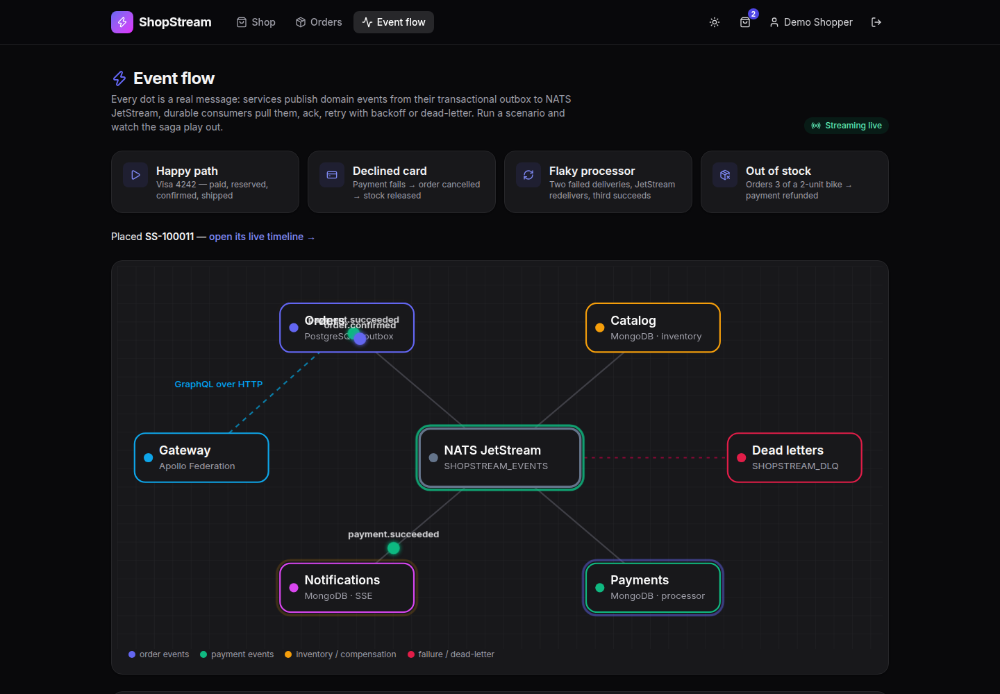
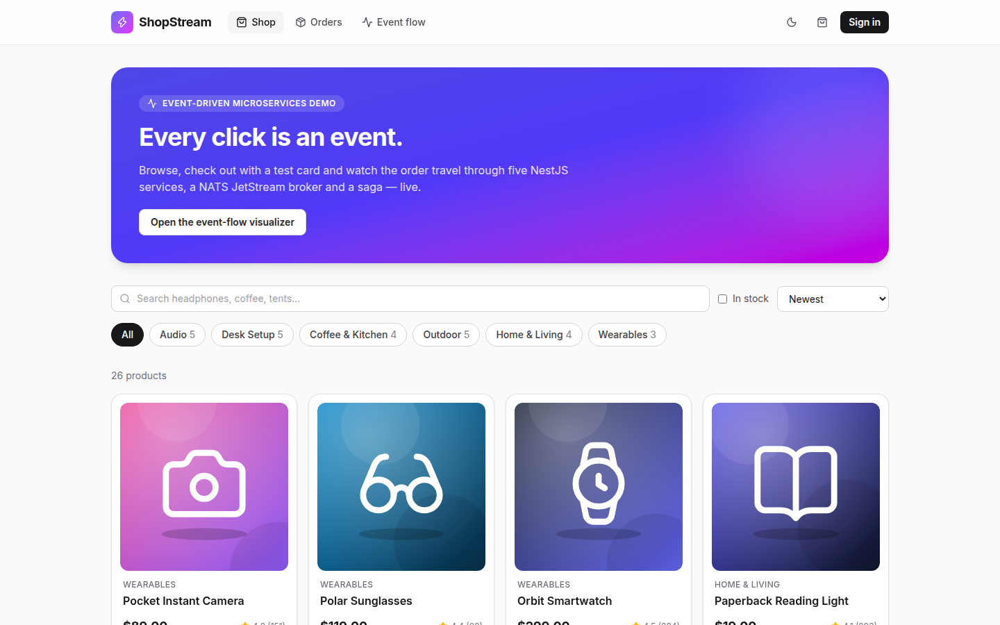
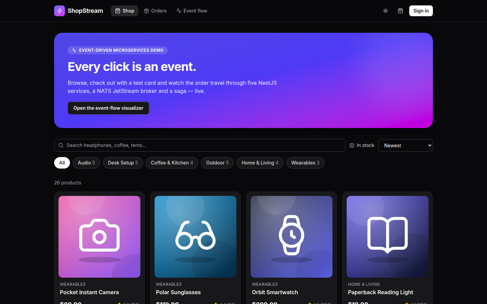
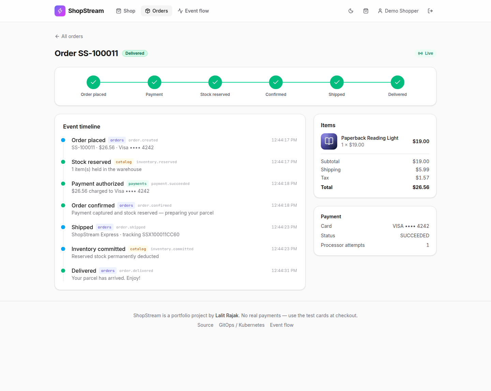
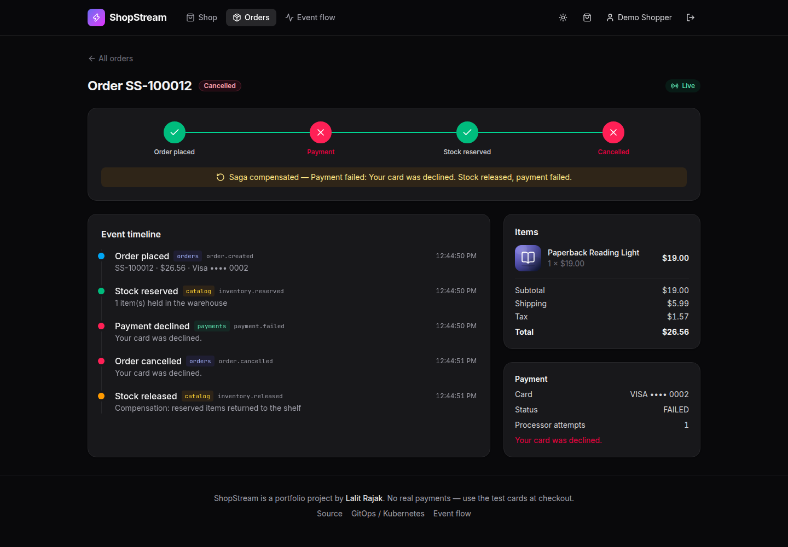
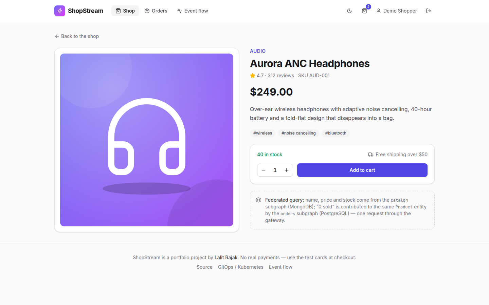
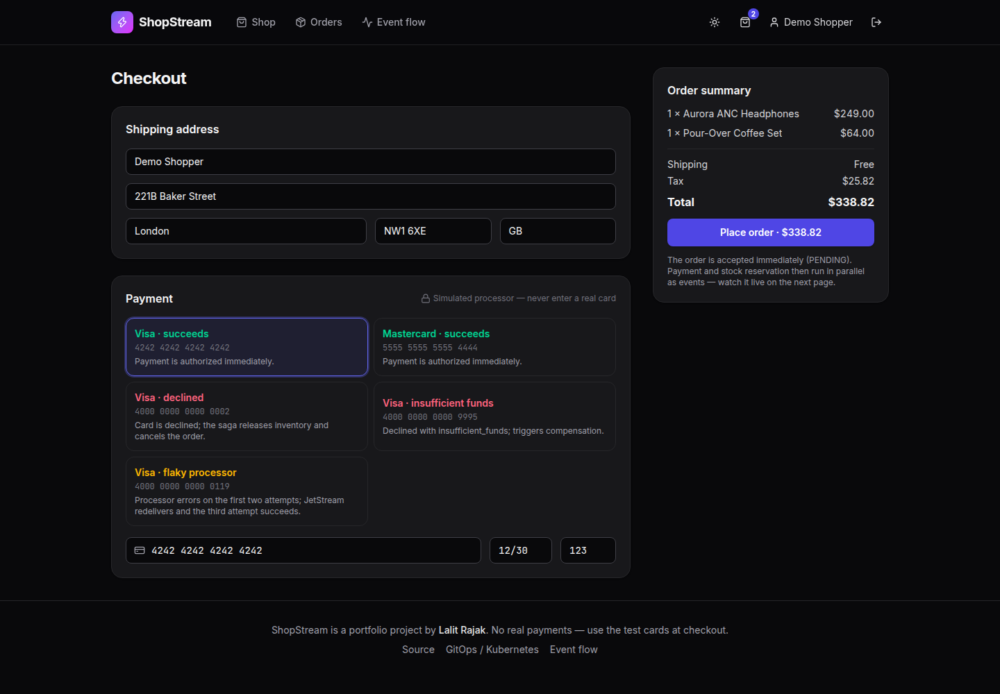
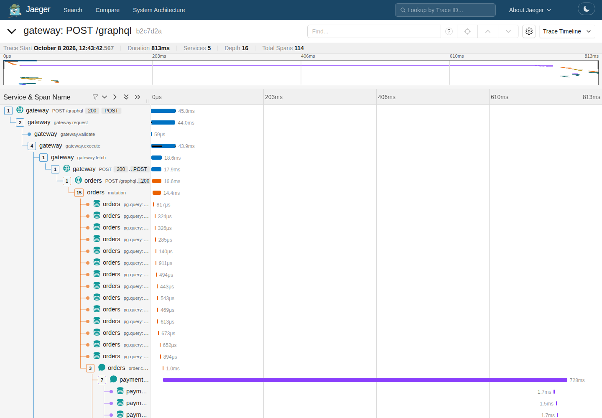
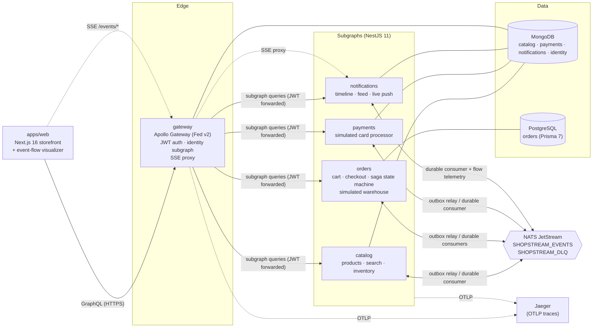
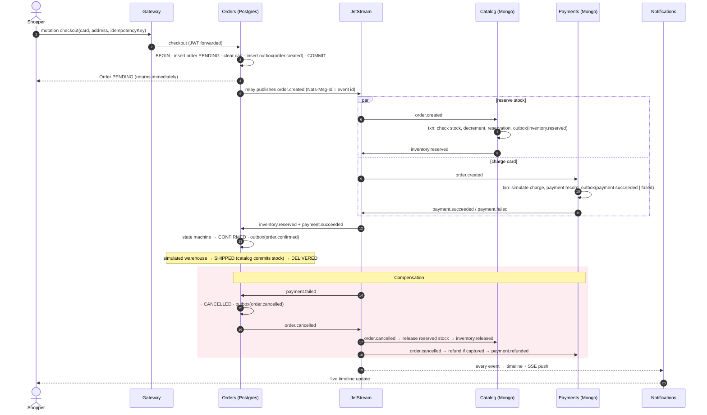

# ShopStream

**Event-driven e-commerce on microservices.** Five NestJS services behind one Apollo Federation v2
supergraph, MongoDB + PostgreSQL (Prisma 7), NATS JetStream with a transactional outbox, idempotent
consumers and a choreographed checkout **saga with compensation** — plus a Next.js 16 storefront with a
live order timeline and a real-time **event-flow visualizer**.

**[Live demo](https://shopstream-lalit.vercel.app)** · demo login `demo@shopstream.dev` / `demo-password`
(or one click on "Continue as the demo shopper") · Kubernetes/GitOps deployment:
[rajak312/shopstream-gitops](https://github.com/rajak312/shopstream-gitops)

> The demo API runs on a free tier that sleeps when idle; the UI shows a "waking up the services…" banner
> for the ~30–60 s cold start.



| Storefront (light)                                     | Storefront (dark)                                       |
| ------------------------------------------------------ | ------------------------------------------------------- |
|    |       |
| **Live order timeline**                                | **Saga compensation (declined card)**                   |
|  |  |
| **Product page (federated entity)**                    | **Checkout with deterministic test cards**              |
|                |               |

**One checkout traced across all five services** (gateway → orders → JetStream → payments/catalog/notifications), Jaeger:



---

## Contents

- [Architecture](#architecture)
- [The checkout saga](#the-checkout-saga)
- [Event catalog](#event-catalog)
- [Federated schema](#federated-schema)
- [Design decisions](#design-decisions)
- [Tech stack](#tech-stack)
- [Getting started](#getting-started)
- [Testing](#testing)
- [Deployment](#deployment)
- [Repository layout](#repository-layout)
- [Known limitations](#known-limitations)

## Architecture



- **Synchronous path:** the browser only talks GraphQL to the gateway. The gateway composes the
  supergraph from the four subgraphs (plus an in-process `identity` subgraph), plans each query and fans
  out to the subgraphs, forwarding the verified JWT. Subgraphs re-verify it (zero trust between services).
- **Asynchronous path:** every state change that other services care about is written to the owning
  service's **outbox** in the same database transaction, published to **JetStream** by a relay, and
  consumed by **durable pull consumers** with explicit acks, backoff retries and a dead-letter stream.
- **Live updates:** notifications turns events into an order timeline and pushes them over core-NATS
  fan-out to whichever replica holds the user's **Server-Sent Events** connection; the gateway
  authenticates and proxies the stream. Every publish/consume/retry/dead-letter also emits a
  lightweight telemetry message that drives the **event-flow visualizer**.

## The checkout saga

Choreography, not orchestration: no service tells another what to do; each reacts to facts.
Payment and stock reservation run **in parallel**; the order is confirmed only when both succeed.



The order state machine is a pure function (`services/orders/src/domain/order-state-machine.ts`) with
its own test suite. It handles every ordering of the parallel branches, late events after a cancellation
(they never "resurrect" an order), and exactly-once emission of `order.cancelled`. Catalog and payments
leave **tombstones** when an `order.cancelled` overtakes the `order.created` it refers to, so a late
`order.created` neither reserves stock nor charges the card.

**Test cards** (deterministic, modelled on Stripe's):

| Card                  | Outcome                                                                     |
| --------------------- | --------------------------------------------------------------------------- |
| `4242 4242 4242 4242` | succeeds                                                                    |
| `5555 5555 5555 4444` | succeeds (Mastercard)                                                       |
| `4000 0000 0000 0002` | `card_declined` → order cancelled, stock released                           |
| `4000 0000 0000 9995` | `insufficient_funds` → compensation                                         |
| `4000 0000 0000 0119` | processor error on the first two deliveries; JetStream redelivers, 3rd wins |

Buying more units of the **Limited Edition Trail Bike** than are in stock exercises the other
compensation branch: the card is charged, stock is rejected, the order is cancelled and the payment is
refunded. Raw card numbers never leave the orders service — it validates (Luhn + expiry) and tokenizes
them; only `{token, brand, last4}` is stored or published.

## Event catalog

All events share a versioned, zod-validated envelope (`packages/contracts`) inspired by CloudEvents:
`id`, `type`, `version`, `source`, `occurredAt`, `correlationId` (the order id) and `causationId`. They
are validated on publish **and** on consume; a malformed message goes straight to the dead-letter stream.
W3C `traceparent` travels in the NATS headers.

| Event                      | Producer | Consumers                        | Purpose                                                                                     |
| -------------------------- | -------- | -------------------------------- | ------------------------------------------------------------------------------------------- |
| `catalog.product.upserted` | catalog  | orders                           | Event-carried state transfer: orders keeps a local price replica — no sync call at checkout |
| `order.created`            | orders   | catalog, payments, notifications | Starts the saga                                                                             |
| `inventory.reserved`       | catalog  | orders, notifications            | All lines reserved atomically (MongoDB transaction)                                         |
| `inventory.rejected`       | catalog  | orders, notifications            | Insufficient stock; nothing reserved                                                        |
| `payment.succeeded`        | payments | orders, notifications            | Card authorized                                                                             |
| `payment.failed`           | payments | orders, notifications            | Card declined → triggers cancellation                                                       |
| `order.confirmed`          | orders   | notifications                    | Paid and reserved                                                                           |
| `order.cancelled`          | orders   | catalog, payments, notifications | **Compensation trigger** (release stock / refund)                                           |
| `inventory.released`       | catalog  | orders, notifications            | Compensation done: stock returned                                                           |
| `payment.refunded`         | payments | orders, notifications            | Compensation done: charge refunded                                                          |
| `order.shipped`            | orders   | catalog, notifications           | Simulated warehouse shipped; catalog commits the reservation                                |
| `inventory.committed`      | catalog  | notifications                    | Reserved stock permanently deducted                                                         |
| `order.delivered`          | orders   | notifications                    | Terminal happy-path state                                                                   |

Subjects: `shopstream.events.<type>` (stream `SHOPSTREAM_EVENTS`), dead letters
`shopstream.dlq.<consumer>.<type>` (stream `SHOPSTREAM_DLQ`), live telemetry `shopstream.flow.<service>`
(core NATS, not persisted).

## Federated schema

Each subgraph owns its slice of the graph and extends entities owned by others. The full composed API
schema is generated into [`docs/supergraph.graphql`](docs/supergraph.graphql) by
`npm run schema:supergraph` (CI fails if the subgraphs stop composing).

| Subgraph        | Owns                                                                            | Extends             |
| --------------- | ------------------------------------------------------------------------------- | ------------------- |
| `identity`¹     | `User`, `register` / `login` / `demoLogin`, `me`                                | —                   |
| `catalog`       | `Product @key(id)`, `Category`, `products` (search, filters, keyset pagination) | —                   |
| `orders`        | `Cart`, `Order @key(id)`, `checkout`, `myOrders`, `cancelOrder`, `testCards`    | `Product.unitsSold` |
| `payments`      | `Payment`                                                                       | `Order.payment`     |
| `notifications` | `Notification` feed, `TimelineEntry`                                            | `Order.timeline`    |

¹ runs inside the gateway process as a `LocalGraphQLDataSource`.

One query, four subgraphs, two databases:

```graphql
query {
  order(id: "…") {
    number
    status
    total {
      formatted
    } # orders   (PostgreSQL)
    items {
      product {
        name
        available
      }
    } # catalog  (MongoDB)
    payment {
      status
      attempts
    } # payments (MongoDB)
    timeline {
      title
      source
      occurredAt
    } # notifications (MongoDB)
  }
}
```

Products are paginated with **keyset (cursor) pagination** on `(sortKey, _id)` backed by compound
indexes — stable under concurrent inserts — and full-text search uses a weighted MongoDB text index with
relevance ordering. Entity lookups from other subgraphs are batched with DataLoader.

## Design decisions

**Why a transactional outbox?** Writing to the database and publishing to a broker are two systems; doing
both from a request handler loses or invents events whenever one of them fails between the two writes.
The outbox makes the event part of the same ACID transaction as the state change (Postgres for orders,
MongoDB multi-document transactions elsewhere). A relay publishes in commit order using
`FOR UPDATE SKIP LOCKED` leases (several replicas can run it), and is nudged right after each commit so
latency stays in milliseconds. Delivery is at-least-once; the event id doubles as JetStream's
`Nats-Msg-Id`, so relay retries inside the 2-minute duplicate window are dropped by the broker.

**Why NATS JetStream (vs. Kafka/RabbitMQ)?** One ~20 MB static binary with persistence, durable pull
consumers, per-message acks, redelivery with backoff, `max_deliver`, publish de-duplication and core
pub/sub for ephemeral fan-out — everything this system needs, cheap enough to embed in a 512 MB demo
container and simple to run as a StatefulSet in Kubernetes. Kafka's partitioned log would be overkill for
this volume and much heavier to operate.

**Idempotent consumers.** Each handler inserts `(consumer, eventId)` into a `processed_events`
table/collection **in the same transaction** as its side effects. A redelivery finds the marker and is
acked without effect; a crash before commit rolls the marker back so the retry runs from scratch. On top
of that, saga steps are idempotent by construction (one reservation and one payment per order id, keyed
on the order id), and order updates use optimistic concurrency (`version` column) because payment and
inventory events for one order can arrive concurrently.

**Retries and dead letters.** Handlers that throw are `nak`ed with backoff (250 ms → 1 s → 3 s → 10 s);
after 5 deliveries — or immediately for poison messages that fail schema validation — the message is
copied to `SHOPSTREAM_DLQ` with the reason/attempt headers and terminated, so one bad message never blocks
a consumer. Retries are visible live in the visualizer (try the flaky card).

**Event-carried state transfer.** Checkout must price the cart. Rather than calling catalog synchronously
(coupling availability of checkout to catalog), orders keeps a replica of product name/price fed by
`catalog.product.upserted`.

**Apollo Gateway in NestJS (not Apollo Router).** The brief asked for a NestJS gateway, and keeping it in
Node lets the gateway host the identity subgraph in-process, the SSE proxy and JWT verification in one
small service with the same logging/metrics/tracing stack as everything else. Composition happens at
start-up with a resilient loader (retries until all subgraphs answer, then polls for schema changes) so
the gateway never crash-loops because it booted first. In production at scale Apollo Router (Rust) would be
the faster choice; the subgraphs would not change.

**SSE instead of GraphQL subscriptions.** The JS Apollo Gateway cannot federate subscriptions (Router
needs an enterprise licence for it). Server-Sent Events are plain HTTP, auto-reconnect, pass through
Render/Vercel/ingress-nginx untouched, and are all that one-way live updates need. Notifications replicas
share work through core-NATS fan-out, so no sticky sessions are required.

**One Dockerfile pattern, one-process demo mode.** `docker/service.Dockerfile` builds any service
(`--build-arg SERVICE=…`) in four stages, installs only that workspace's production dependencies and runs
as the non-root `node` user on a read-only filesystem. For the free-tier demo, `deploy/allinone` boots all
services inside **one** Node.js process (each with its own Nest app, port, config, connections and metrics
registry) next to an embedded `nats-server`: ~180 MB RSS instead of five Node runtimes. The same launcher
powers the Testcontainers e2e suite.

**Security basics.** scrypt password hashing, HS256 JWTs with issuer/audience/expiry checks, subgraphs
re-verify tokens, ownership checks on every order/payment/timeline resolver, rate-limited auth mutations,
GraphQL depth limiting, masked internal errors in production, strict CORS allow-list, redacted log fields,
non-root read-only containers.

## Tech stack

| Area          | Choice                                                                                                                                                                                      |
| ------------- | ------------------------------------------------------------------------------------------------------------------------------------------------------------------------------------------- |
| Language      | TypeScript 5.9 (strict, `noUncheckedIndexedAccess`), Node.js 24, npm workspaces                                                                                                             |
| Services      | NestJS 11, Apollo Server 5, Apollo Federation v2 (`@apollo/gateway`, `@apollo/subgraph`)                                                                                                    |
| Data          | MongoDB (Mongoose 9, multi-document transactions, text indexes) · PostgreSQL (Prisma 7: `prisma-client` generator, `@prisma/adapter-pg`, `prisma.config.ts`)                                |
| Messaging     | NATS JetStream (`@nats-io/jetstream` v3) — durable pull consumers, DLQ, de-duplication                                                                                                      |
| Contracts     | zod 4 schemas shared by producers and consumers (`packages/contracts`)                                                                                                                      |
| Observability | OpenTelemetry (HTTP, Express, GraphQL, MongoDB, pg + manual NATS producer/consumer spans), Jaeger, pino JSON logs with `trace_id`, Prometheus metrics (`/metrics`, RED + consumer outcomes) |
| Web           | Next.js 16 (App Router, Turbopack), React 19, Tailwind CSS v4, TanStack Query, lucide icons                                                                                                 |
| Quality       | Vitest (unit + Testcontainers e2e), ESLint 9 flat config, Prettier, GitHub Actions                                                                                                          |
| Delivery      | Docker multi-stage images → GHCR (multi-arch), Helm + Argo CD ([gitops repo](https://github.com/rajak312/shopstream-gitops)), Render + Vercel demo                                          |

## Getting started

Prerequisites: Docker, Node.js 24 (only for local development without containers).

### Everything in Docker

```bash
docker compose up --build
```

| URL                                                   | What                                                                                      |
| ----------------------------------------------------- | ----------------------------------------------------------------------------------------- |
| http://localhost:3700                                 | Storefront (sign in with the demo account)                                                |
| http://localhost:3700/flow                            | Event-flow visualizer                                                                     |
| http://localhost:4700/graphql                         | Gateway (GraphQL, POST)                                                                   |
| http://localhost:4716                                 | Jaeger UI (traces)                                                                        |
| http://localhost:4782                                 | NATS monitoring                                                                           |
| `localhost:4701`–`4704`                               | catalog · orders · payments · notifications (`/health`, `/ready`, `/metrics`, `/graphql`) |
| `localhost:27117`, `localhost:4710`, `localhost:4722` | MongoDB, PostgreSQL, NATS                                                                 |

Then run the scripted end-to-end smoke test against it:

```bash
node scripts/smoke.mjs        # GATEWAY_URL defaults to http://localhost:4700/graphql
```

> **Note:** MongoDB 8.x refuses to start on Linux kernels ≥ 6.19 (SERVER-121912), so compose defaults to
> `mongo:7.0`. Override with `MONGO_IMAGE=mongo:8 docker compose up` on older kernels.

### Local development

```bash
npm ci
npm run dev:infra                 # mongo, postgres, nats, jaeger
cp .env.example .env
npm run build:services            # prisma generate + tsc -b (project references)
npm run prisma:migrate -w @shopstream/orders
# run each service (or everything at once in one process):
set -a; . ./.env; set +a
PORT=4700 NATS_EMBEDDED=false node deploy/allinone/dist/main.js
npm run dev -w @shopstream/web    # http://localhost:3700
```

### Scripts

| Command                         | Does                                                                       |
| ------------------------------- | -------------------------------------------------------------------------- |
| `npm run build`                 | Prisma client + all services (tsc project references) + web                |
| `npm run typecheck`             | Type-checks every workspace                                                |
| `npm run lint` / `format:check` | ESLint 9 flat config / Prettier                                            |
| `npm test`                      | Unit tests                                                                 |
| `npm run test:e2e`              | Testcontainers end-to-end suite (needs Docker, run `build:services` first) |
| `npm run schema:supergraph`     | Compose the supergraph offline → `docs/supergraph.graphql`                 |
| `npm run smoke`                 | Checkout smoke test against a running gateway                              |
| `npm run images:generate`       | Regenerate the bundled SVG product illustrations                           |

## Testing

- **Unit (101 tests, Vitest)** — money math (integer cents, half-away-from-zero basis-point rounding),
  card validation/tokenization, event contracts, the **order state machine** incl. every compensation
  path and out-of-order delivery, checkout pricing, **outbox relay** (ordering, stop-at-first-failure,
  batching, wake-ups), **retry/DLQ decisions and delivery processing**, the **idempotent-consumer**
  helper (incl. rollback), reservation planning + compensation decisions, keyset cursors, the payment
  simulator, password hashing, rate limiting, GraphQL depth limiting, JWTs and config validation.
- **End-to-end (7 tests, Testcontainers)** — starts MongoDB (replica set), PostgreSQL and NATS
  JetStream in containers, boots every service, and drives everything through the federated gateway:
  happy path to `DELIVERED` with stock committed; declined card → `CANCELLED` + stock released; out of
  stock → `CANCELLED` + payment refunded; flaky processor → succeeds on the 3rd JetStream delivery;
  idempotent checkout key; a duplicated event delivered twice is applied once; anonymous access rejected.
- **Smoke** — `scripts/smoke.mjs` runs a happy and a declined checkout against any deployment (compose,
  the all-in-one container, the kind cluster in the gitops repo, or the live demo).

CI (`.github/workflows/ci.yml`) runs lint, format, typecheck (Prisma client generated first, so it works
from a clean checkout), supergraph composition, unit tests, the web build, the Testcontainers suite and
Docker builds. `release.yml` pushes multi-arch (amd64/arm64) images to GHCR.

## Deployment

### Images (GitHub Actions → GHCR)

On every push to `main`, `release.yml` builds and pushes

`ghcr.io/rajak312/shopstream-{gateway,catalog,orders,payments,notifications,web,allinone}`

tagged with the full git SHA and `latest`. If the repository secret **`GITOPS_TOKEN`** (a fine-grained PAT
with `contents: write` on `rajak312/shopstream-gitops`) exists, a follow-up job bumps
`environments/dev/values.yaml` in the GitOps repo to the new SHA and Argo CD rolls dev forward; without
the secret the job is skipped and the workflow stays green. Production is promoted by PR in the gitops
repo.

### Kubernetes

Helm charts, Argo CD app-of-apps, dev/prod environments, NetworkPolicies, observability and a one-command
kind bootstrap live in **[shopstream-gitops](https://github.com/rajak312/shopstream-gitops)**.

### Free-tier live demo (Render + Vercel + Neon + Atlas)

There is no free hosted NATS, and five always-on services don't fit a free tier, so the demo uses the
**all-in-one image** (`deploy/render/Dockerfile`): embedded `nats-server` + all services in one Node.js
process, listening on `$PORT`, verified locally under `docker run -m 512m` (≈180 MB RSS) with the smoke
test passing. Migrations (`prisma migrate deploy`) and the idempotent catalog seed run at start-up.

| Piece      | Where                                                                                    |
| ---------- | ---------------------------------------------------------------------------------------- |
| API        | Render free web service `shopstream-api`, **Singapore** region (`render.yaml` blueprint) |
| PostgreSQL | Neon free tier, AWS **ap-southeast-1 (Singapore)**                                       |
| MongoDB    | Atlas M0, AWS **ap-south-1 (Mumbai)**                                                    |
| Web        | Vercel (`apps/web/vercel.json`, Root Directory `apps/web`)                               |

The API runs in Singapore to sit next to Neon and within a short hop of the Mumbai Atlas cluster.

**Render environment variables** (`sync: false` = set in the dashboard):

| Variable                                      | Value                                                               |
| --------------------------------------------- | ------------------------------------------------------------------- |
| `DATABASE_URL`                                | Neon **pooled** connection string (`…-pooler…/db?sslmode=require`)  |
| `DIRECT_URL`                                  | Neon **direct** connection string (used by `prisma migrate deploy`) |
| `MONGODB_URI`                                 | Atlas SRV string (`mongodb+srv://…`)                                |
| `JWT_SECRET`                                  | long random string (`openssl rand -base64 48`)                      |
| `CORS_ORIGINS`                                | `https://shopstream-lalit.vercel.app`                               |
| `NODE_ENV`, `LOG_LEVEL`, `DEMO_USER_PASSWORD` | preset in `render.yaml`                                             |

**Vercel project:** Root Directory `apps/web`, framework Next.js (install/build commands come from
`vercel.json` and build the workspace from the repo root), environment variables
`NEXT_PUBLIC_GATEWAY_URL=https://shopstream-api-vcos.onrender.com/graphql` and
`NEXT_PUBLIC_SITE_URL=https://shopstream-lalit.vercel.app`.

## Repository layout

```
packages/contracts     zod event schemas, subjects, event catalog, money math, test cards (shared with web)
packages/platform      config, pino logging, OpenTelemetry, NATS JetStream bus (publisher, durable consumer,
                       DLQ, flow telemetry), outbox relay, idempotency, health/readiness, metrics, auth
services/gateway       Apollo Federation gateway + identity subgraph + SSE proxy
services/catalog       products, categories, search, keyset pagination, inventory saga step (MongoDB)
services/orders        cart, checkout, order state machine, outbox, simulated warehouse (PostgreSQL/Prisma 7)
services/payments      simulated card processor, refunds (MongoDB)
services/notifications order timeline, notification feed, SSE hub (MongoDB)
deploy/allinone        single-process launcher (+ embedded nats-server) for the demo and e2e tests
deploy/render          all-in-one Dockerfile;  render.yaml at the repo root
docker/                shared service Dockerfile + node_modules pruning
apps/web               Next.js 16 storefront, live order timeline, event-flow visualizer
tests/e2e              Testcontainers end-to-end suite
scripts/               smoke test, supergraph composition, product-art generator
```

## Known limitations

- Payments, fulfilment and carriers are **simulated**; no real money moves and card data is fake.
- Auth is deliberately simple (email/password + HS256 JWT at the gateway, no refresh tokens). A real
  deployment would delegate to an OIDC provider (e.g. Keycloak) and use asymmetric keys.
- The auth rate limiter is per-process (fine for one gateway replica; use Redis for many).
- The flow telemetry and SSE fan-out use core NATS (at-most-once) by design — they are UX, not data.
- The all-in-one demo trades isolation for cost: one process means one failure domain, and JetStream
  data lives on the container's ephemeral disk (the outbox tables are the source of truth, and the
  catalog replica is re-published on boot if it changes).
- MongoDB features used (transactions) require a replica set — Atlas provides one; compose initialises a
  single-node set.

## License

[MIT](LICENSE) © Lalit Rajak
